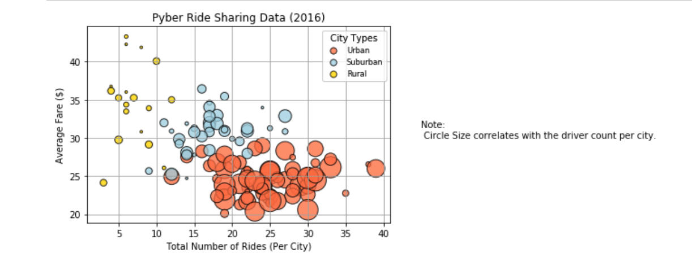

# Visulizing Ridshare Data

For this exercise I was working for a fictitious rideshare company. I was given the company's complete record set of rides. This contains information about every active driver and historic ride, including details like city, driver count, individual fares, and city type. My job was to create insightful visualizations using Python Pandas and Matplotlib.

# Bubble Plot

This plot showcases the relationship between four key variables:

- Average Fare ($) Per City
- Total Number of Rides Per City
- Total Number of Drivers Per City
- City Type (Urban, Suburban, Rural)

# Breakdown by City Type

% of Total Fares by City Type

% of Total Rides by City Type

% of Total Drivers by City Type

